# 🖼 Automated Image Analysis

On this page, you will learn how to perform **automated image analysis** with DL_Track_US.  
The images are evaluated **without user input** and can be **scaled**.  
Scaling ensures that estimated muscle architectural parameters are converted into **centimetre units**.

**Important:** This type of analysis works **only for single images**, not videos.  
All images must be contained in a single folder, for example:  
`DL_Track_US_example/images`.

If you have not downloaded the example dataset yet, please do so now:  
[DL_Track_US - Examples & Models](https://osf.io/7mjsc/?view_only=).

> 📦 Unzip the folder and save it somewhere easily accessible.

---

## 1. Creating Image Directory & FlipFlag.txt File

- All images you want to analyze must be placed in **one folder**.
- The folder `DL_Track_US_example/images` contains **4 images** and a **flip_flag.txt** file.
- It is not required to have the `flip_flag.txt` file in the same folder as the images, but it is convenient.

Let's take a closer look at the `flip_flag.txt` file:

- For each image, there must be a corresponding **flip-flag**.
- The flip-flag determines whether an image should be flipped during analysis:  
    - `0` = no flip  
    - `1` = flip the image
- If the number of flip-flags and images does not match, an error will be raised.

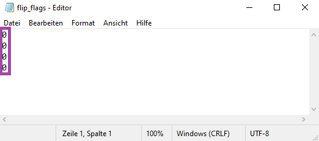

When using **multiple subfolders**, the flip-flag file format looks like this:

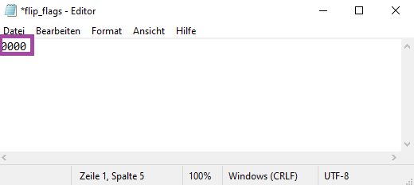

- None of the example images must be flipped — their fascicle orientation is already correct, with fascicles originating at the **bottom left** and inserting at the **top right**.
- Below is a visual representation of the **correct fascicle orientation**.  
If your fascicles are oriented differently, please specify a `1` flip-flag for those images.

## 2. Specifying Input Directories in the GUI

Once the GUI is opened, the first step of every analysis in DL_Track_US is to specify the input directories.

- First, specify the path to the folder containing the images to be analysed.  
  Remember, this was the folder `DL_Track_US_example/images`.
    - Click the **Inputs** button. A selection window opens where you can select the folder.  
    - Click **Select folder** to confirm your choice.

- Second, specify the absolute path to the **aponeurosis neural network**.  
  This is located in the `DL_Track_US_example/DL_Track_US_models` folder.
    - Click the **Apo Model** button to open a selection window.
    - Select the **aponeurosis model** and click **Open**.

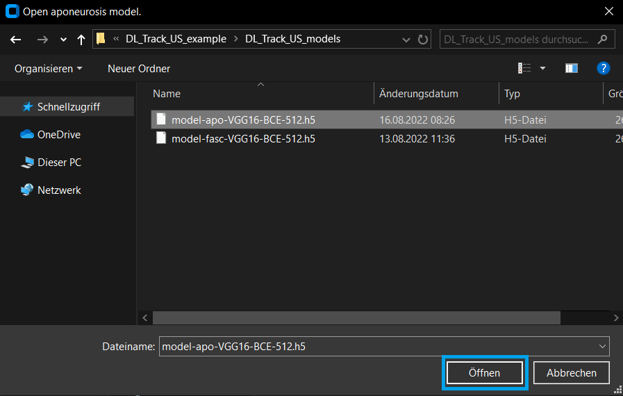

- Third, specify the absolute path to the **fascicle neural network** (also located in `DL_Track_US_example/DL_Track_US_models`).
    - Click the **Fasc Model** button to select the **fascicle model**.
    - Confirm by clicking **Open**.

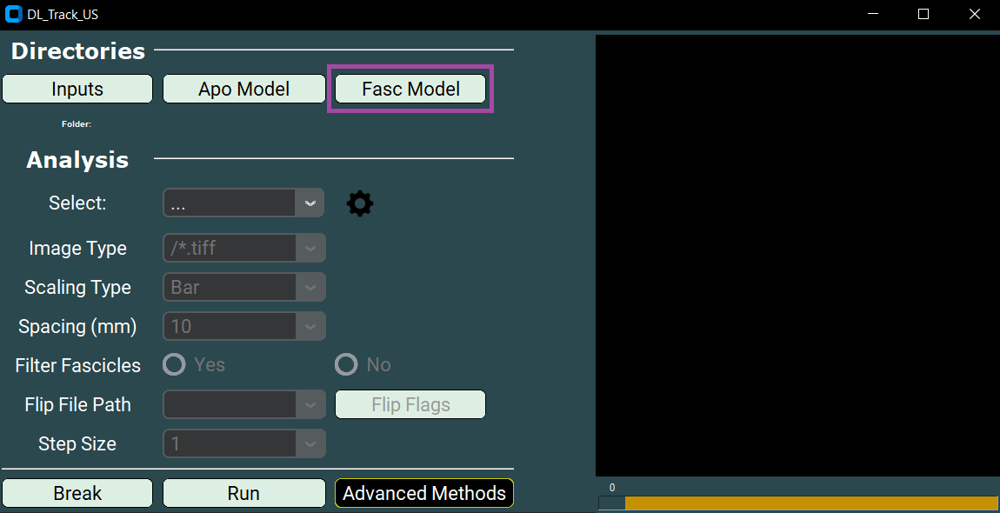
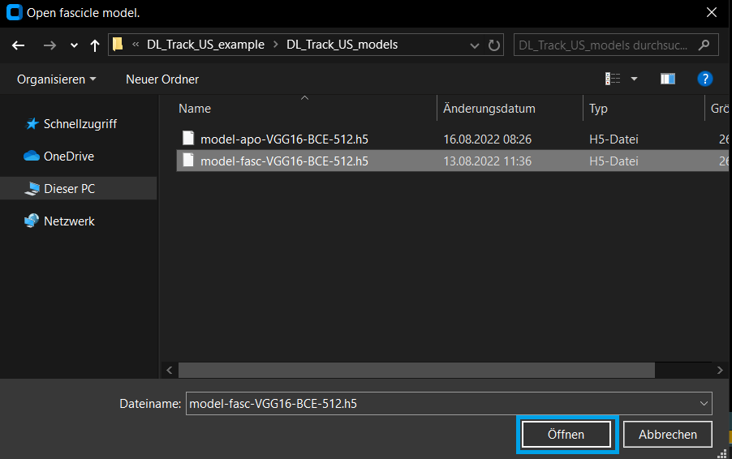

---

In the next step, you will specify all relevant analysis parameters, including the **analysis type**.  
We will explain what each parameter controls.

## 3. Specifying Analysis Parameters

As a first step, select the correct **analysis type** in the GUI:

- Select **image** in the dropdown menu.

---

Next, you need to specify the **Image Type**.

- The **ending** of the Image Type must match the ending of your input images — otherwise no files will be found.
- You can either select a pre-specified ending from the dropdown list or type in your own.
- Please keep the formatting similar to the provided examples.
- In the `DL_Track_US_example/images` folder, the images are of type **“/*.tif”**.

---

Then, specify the **Scaling Type**.

- Scaling converts measurements from **pixels** to **centimetres**.
- There are three scaling types available:
  - **None** (no scaling),
  - **Bar** (based on visible scaling bars),
  - **Manual** (manual point selection).

For this tutorial, select **None**.

---

If you choose the **Bar** Scaling Type:

- This method works if clear **scaling bars** are present in your ultrasound image (usually on the right side).
- The bars do not need to be identical to the example, but they must be clearly separated and visible.

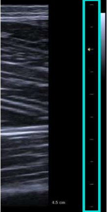

- We recommend testing the Bar Scaling Type on a small sample of your images first.
- Files that cannot be analysed with this scaling method will be listed in a `failed_images.txt` inside your input folder.

---

If you choose the **Manual** Scaling Type:

- You must manually place **two points** on the image at a known distance.
- Click the **Calibrate** button to begin manual calibration.

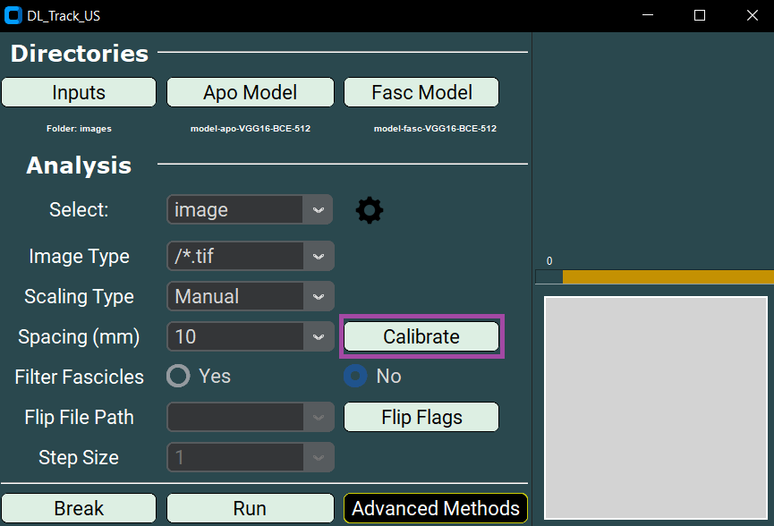

- Click once with the left mouse button to set the first point (a red dot will appear).
- Place the second point according to the real-world distance (5, 10, 15, or 20 mm).
- Afterwards, click **Confirm**.

- A **message box** will appear showing the corresponding pixel distance.

---

Regardless of scaling type, whenever you use Bar or Manual scaling:

- You must also set the **Spacing** parameter.
- Select 5, 10, 15, or 20 millimetres from the dropdown.

For this tutorial, the Spacing parameter is **not necessary** since scaling is set to **None**.

---

Another setting is the **Filter Fascicle** option:

- You can choose **YES** or **NO**.
- If set to **YES**, all fascicles that overlap are removed during post-processing.

Below you can see examples of the results with and without fascicle filtering:

---

As the next step, specify the path to the **flip_flag.txt** file:

- Click the **Flip Flags** button.
- Select the **flip_flag.txt** file, located in the `DL_Track_US_example/images` folder.
- Ensure that the number of flip flags matches the number of images.

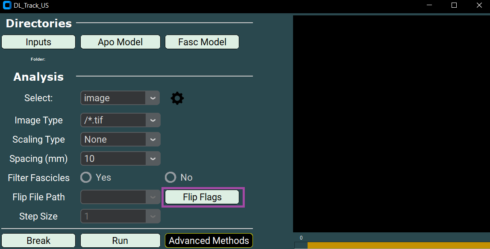

## 4. Adjusting Settings

As a last step before starting the analysis, you need to adjust the settings used by the aponeurosis and fascicle neural networks.

- Click the **settings wheel** button in the GUI.  
This will open the `settings.py` file in your default text editor.

- The `settings.txt` file contains a dictionary of all relevant analysis parameters.
- Default values are listed, and each parameter is explained at the top of the file.

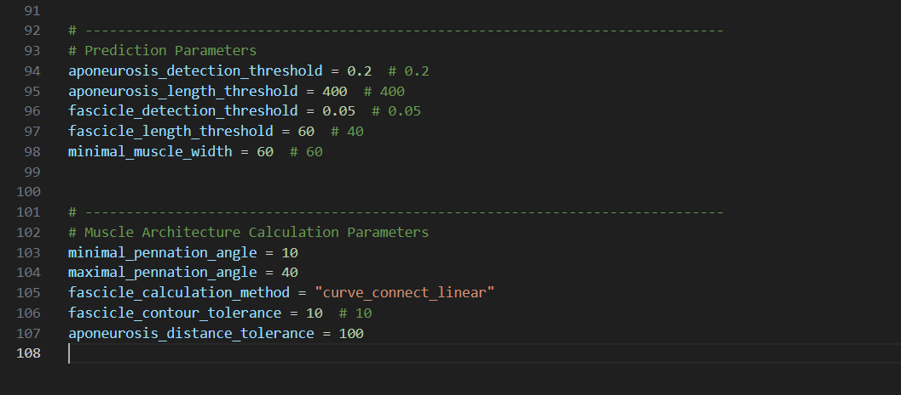

---

Key parameters explained:

- **Aponeurosis detection threshold**:  
  Minimum probability a pixel must reach to be classified as aponeurosis.  
  Lower values include more pixels.

- **Aponeurosis length threshold**:  
  Minimum or maximum length of structures detected as aponeuroses.

- **Fascicle detection threshold** and **fascicle length threshold**:  
  Same as above, but for fascicles.

- **Minimal muscle width**:  
  Minimum distance between superficial and deep aponeuroses.

- **Minimal and Maximal Pennation angles**:  
  Range of physiologically possible pennation angles for the muscle.

- **Fascicle calculation method**:  
  Method used to calculate fascicle length.  
  Options:
    1. `linear_extrapolation`
    2. `curve_polyfitting`
    3. `curve_connect_linear`
    4. `curve_connect_poly`
    5. `orientation_map`

- **Fascicle contour tolerance**:  
  Minimum acceptable fascicle length. Lower values allow shorter segments.

- **Aponeurosis distance tolerance**:  
  Maximal allowed distance from fascicles to aponeuroses for valid measurements.

- **Selected filter**:  
  Method used to filter outliers from fascicle length and pennation angle data.
  
  Options:

    1. `hampel` (default)
    2. `median`
    3. `gaussian`
    4. `savitzky_golay`

- **Hampel window size**:  
  Number of data points considered during outlier detection.

- **Hampel number of deviations**:  
  Number of standard deviations for outlier detection.

- **Segmentation mode**:  
  - `none` ➔ images are segmented separately  
  - `stacked` ➔ three frames are stacked (used for videos only)

---

> 💡 **Tip:**  
> Adapt these parameters according to your images or videos!  
> Correct parameter settings can greatly impact your analysis results.
>
> For future analyses, always test parameter settings on a small sample of your data first.
> *Especially, choose a pennation angle range that is physiologically plausible with a minimum range.*
> 
> If you accidentally disrupt the `settings.txt` file, there is a backup available: `_backup_settings.py`.

## 5. Running / Breaking DL_Track_US

After completing all setup steps, you are ready to start the analysis.

- Click the **Run** button in the main GUI window to begin processing.
- You will also see a **Break** button in the GUI.
- Clicking **Break** allows you to stop the analysis at any time.
  - The currently processed image will be completed,
  - Then the analysis will terminate gracefully.

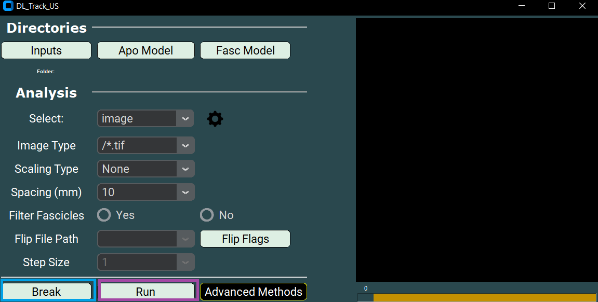

---

Once the analysis runs successfully, the results are displayed as a line graph showing:

- Median Fascicle Length
- Median Filtered Fascicle Length
- Filtered Median Fascicle Length

---

Two output files will be created inside the `DL_Track_US_example/images` folder:

- **ResultImages.pdf**:
  - A multi-page PDF.
  - Each page shows an input image with predicted fascicles and aponeuroses drawn over it.

- **Results.xlsx**:
  - An Excel file containing the estimated architectural parameters for each image.
  - Each row corresponds to an input image.
  - Median fascicle length, median pennation angle, and calculated muscle thickness are provided.

> 📄 **Important:**  
> The `ResultImages.pdf` can only be opened once the `Results.xlsx` has been fully generated.

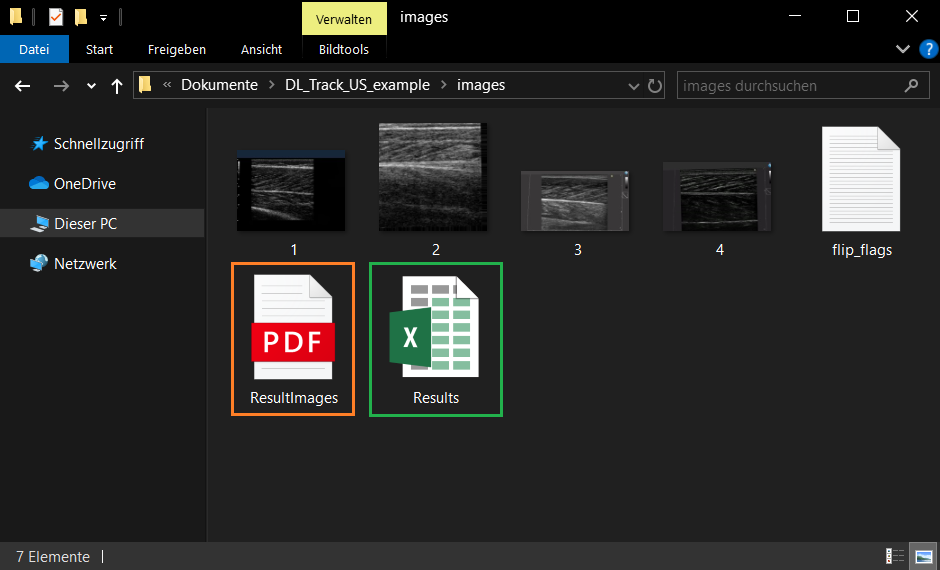

---

🎉 **Congratulations! You have now completed the DL_Track_US tutorial for automated image analysis!**

Before finishing, it is important to review the error handling procedures in case something unexpected occurs.

## 6. Error Handling

During analysis, DL_Track_US has robust error handling to ensure you can identify and correct problems easily.

Whenever an error occurs:

- A **message box** will open inside the GUI.
- It will explain what went wrong and suggest how to fix it.

Example of an error message:

---

We have tried to make all error messages as **concise** and **informative** as possible.  
Simply follow the instructions in the error box and restart the analysis after resolving the issue.

> 💬 **Note:**  
> If an unexpected error occurs that is not caught by a message box,  
> please report it in the [DL_Track_US Discussion Forum - Q&A Section](https://github.com/PaulRitsche/DLTrack/discussions/categories/q-a).

When reporting an issue:

- Please include a description of the problem,
- Steps to reproduce the issue,
- And (if possible) screenshots of the GUI and error message.

---

By following these guidelines, we can continuously improve DL_Track_US.