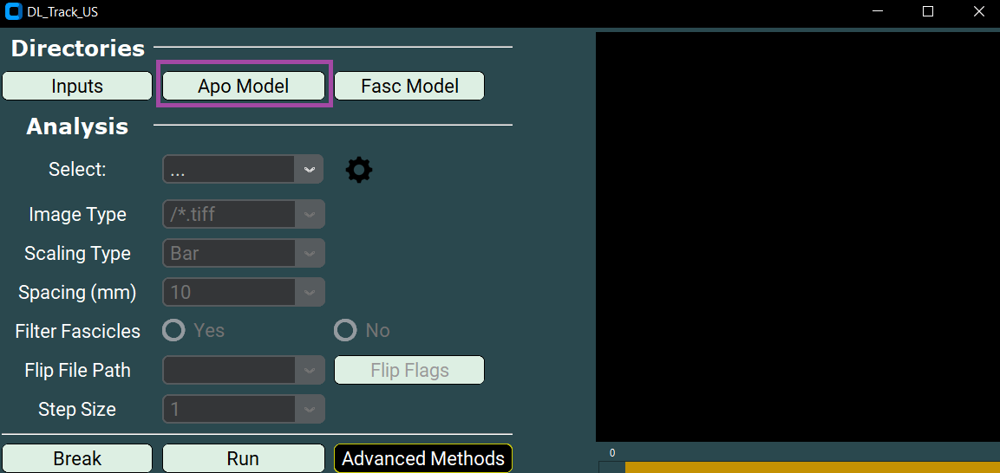
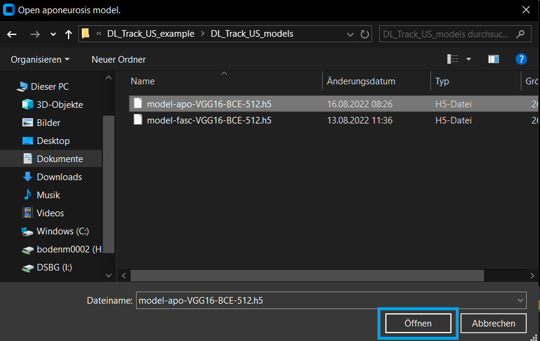
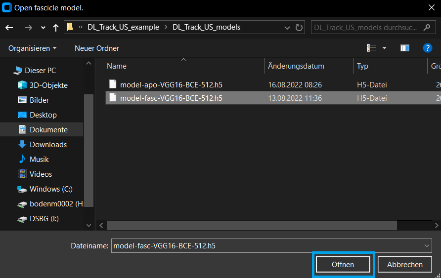
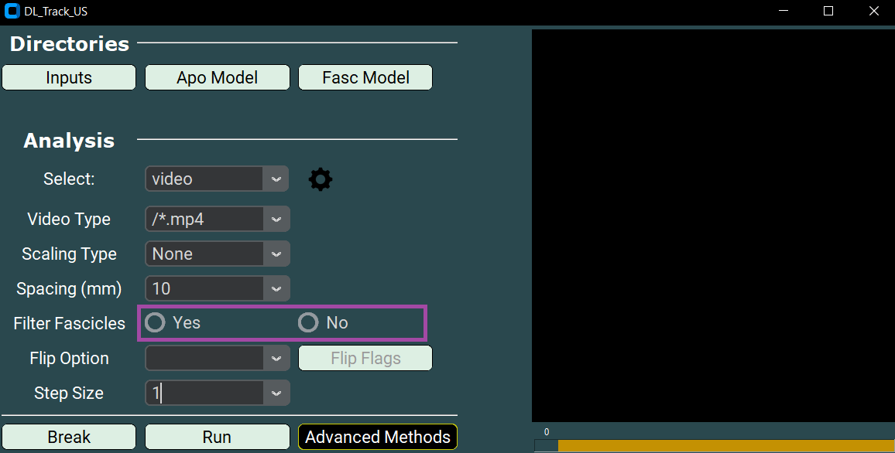
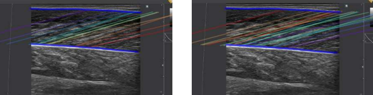
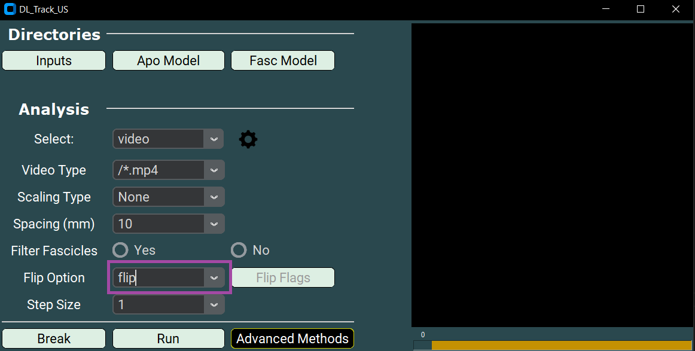
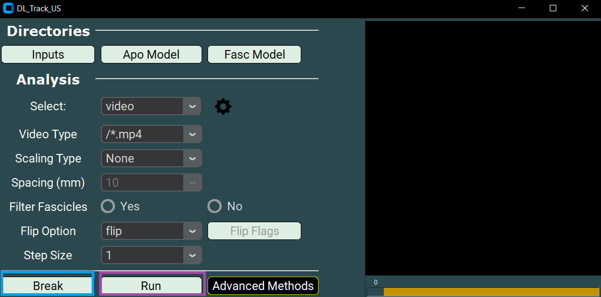

# 🎥 Automated Video Analysis

This page introduces the **automated video analysis** in DL_Track_US.

- Videos are evaluated **without user input**.
- Videos must be contained in a single folder, e.g., `DL_Track_US_example/videos`.

If you have not downloaded the example folder yet, please do so:  
[DL_Track_US - Examples & Models](https://osf.io/7mjsc/?view_only=).

> 📦 Unzip the folder and save it somewhere easily accessible.

---

The automated video analysis is very similar to automated image analysis:  
Only a few analysis parameters differ between the two types.

After the analysis, a `proc.avi` file will be created in the input video directory.  
It can be opened with VLC Player (Windows) or OmniPlayer (macOS).

---

## 1. Creating Video and Network Directories

- Videos should be stored in a **single folder**.
- The `DL_Track_US_example/videos` folder contains **one video**.

---

## 2. Specifying Input Directories in the GUI

Once the GUI is open:

- Click the **Inputs** button to specify the folder containing your video.
- Select the `DL_Track_US_example/videos` folder and click **Select folder**.

---

Next, specify the aponeurosis model:

- Click the **Apo Model** button.
- Select the aponeurosis neural network file from `DL_Track_US_example/models`.
- Click **Open**.

---

Then, specify the fascicle model:

- Click the **Fasc Model** button.
- Select the fascicle neural network file from `DL_Track_US_example/models`.
- Click **Open**.

---

## 3. Specifying Analysis Parameters

### 3.1 Selecting the Analysis Type

- Choose **Video** from the dropdown menu.

---

### 3.2 Setting the Video Type

- The file extension must match your videos (e.g., `.mp4`).
- Select or type **/*.mp4**.

---

### 3.3 Choosing the Scaling Type

- Select **None** for this tutorial.

Alternatively, you could use **Manual** scaling:

- Place two points on a known distance (5, 10, 15, or 20 mm).
- Click **Calibrate**.

After calibration, a **messagebox** shows the pixel distance:

---

### 3.4 Filtering Fascicles

- Select **YES** to remove overlapping fascicles.

Example difference between filtered and unfiltered:

---

### 3.5 Setting Flip Options

- Choose the appropriate flip setting:
  - **Flip** to flip the video vertically,
  - **Don’t Flip** otherwise.

For the example video, flipping is required to correct fascicle orientation.

---

### 3.6 Setting Frame Steps

- Set Frame Step to **1** (every frame analyzed).
- Larger steps (e.g., 3, 10) reduce computation time but skip frames.

---

## 4. Adjusting Settings

Open the settings by clicking the **Settings Wheel**.

- A txt script `settings.txt` opens in your default editor.
- Default values are listed; detailed descriptions are available at the top of the file.

You can find an explanation on all setting in [this chapter](LINK).

---

## 5. Running / Breaking DL_Track_US

- Click the **Run** button to start analysis.
- Use the **Break** button if you need to stop the analysis.

---

Once analysis completes, navigate back to `DL_Track_US_example/videos`.

You will find two new files:

- **calf_raise_proc.avi**:
  - Video showing overlaid segmentation results.

- **calf_raise.xlsx**:
  - Excel file containing estimated muscle parameters (fascicle length, pennation angle, muscle thickness).

---

Line graph results include:

- Median Fascicle Length
- Median Filtered Fascicle Length
- Filtered Median Fascicle Length (based on chosen filter)

---

## 6. Error Handling

If an error occurs:

- A **messagebox** will open to explain the issue.

We have tried to make all error messages as **concise** and **informative** as possible.  
Simply follow the instructions in the error box and restart the analysis after resolving the issue.

> 💬 **Note:**  
> If an unexpected error occurs that is not caught by a message box,  
> please report it in the [DL_Track_US Discussion Forum - Q&A Section](https://github.com/PaulRitsche/DLTrack/discussions/categories/q-a).

When reporting an issue:

- Please include a description of the problem,
- Steps to reproduce the issue,
- And (if possible) screenshots of the GUI and error message.

---

By following these guidelines, we can continuously improve DL_Track_US.