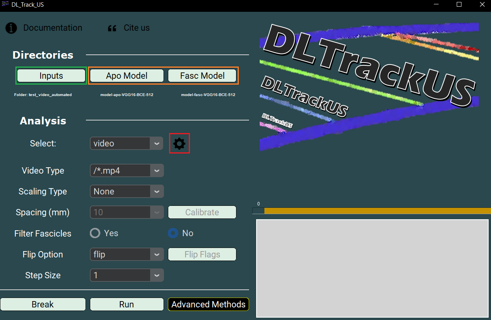
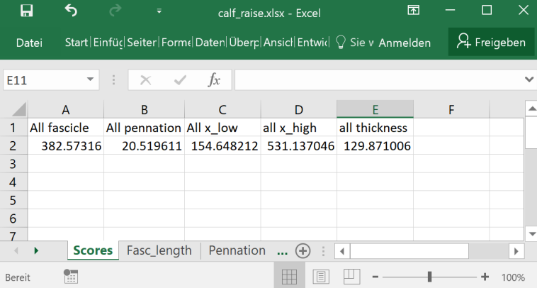

# 🧪 Testing Automated Video Analysis

This page explains how to test the **automated video analysis** functionality in DL_Track_US.

- Single video frames are evaluated **automatically** without user input.
- For this test, **videos** are required.
- The test video is located in:  
  `DL_Track_US_example/tests/test_video_automated`.

---

Before running the test, ensure that:

- You are using the correct **video** located at `DL_Track_US_example/tests/test_video_automated`.
- You are using the provided pre-trained **models**, located at `DL_Track_US_example/models/` (use IFSS for fascicles).
- You have kept the default **parameter settings** in the `settings.json` file unchanged (i.e.: "aponeurosis_detection_threshold": 0.01, "aponeurosis_length_threshold":300, "fascicle_detection_threshold": 0.01, "fascicle_length_threshold": 40, "minimal_muscle_width": 60, "minimal_pennation_angle": 10, "maximal_pennation_angle": 30,).
- You click the **Run** button in the GUI to start the analysis.

---

When the analysis is complete, two new files will appear in the `DL_Track_US_example/tests/test_video_automated` folder:

- **calf_raise_proc.avi** (processed video with predictions)
- **calf_raise.xlsx** (results file)

---

### How to verify the results:

Open the `calf_raise.xlsx` file.
For all frames, calculate the **average** values for:

- Fasc_length_filtered_median
- Pennation_filtered_median
- Muscle thickness

Compare your results to the reference results shown below:

---

✅ If your values are similar, DL_Track_US is working correctly for **automated video analysis**!
