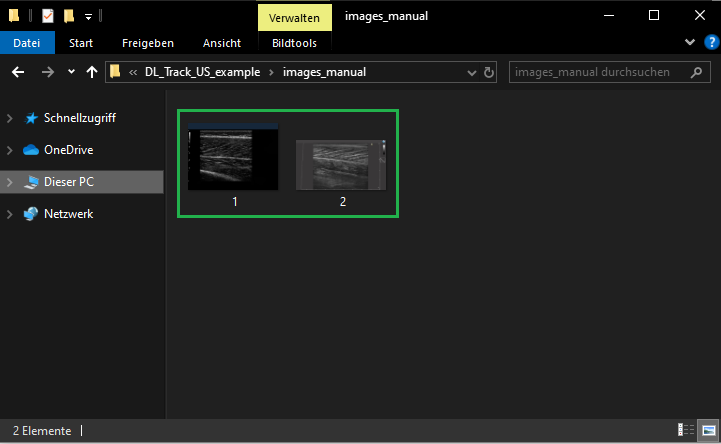
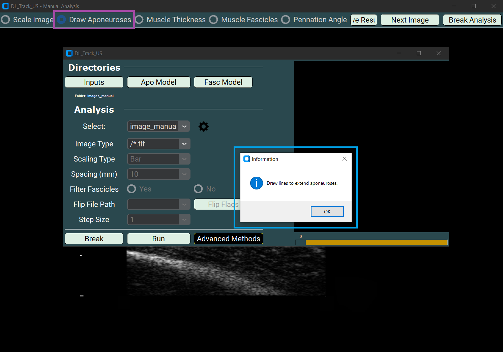
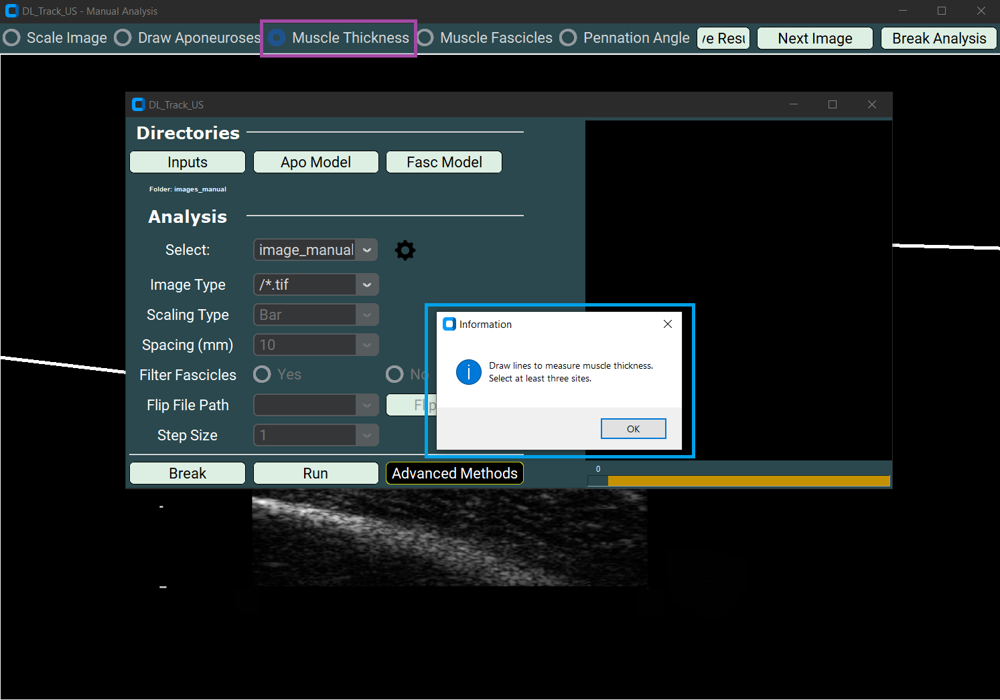
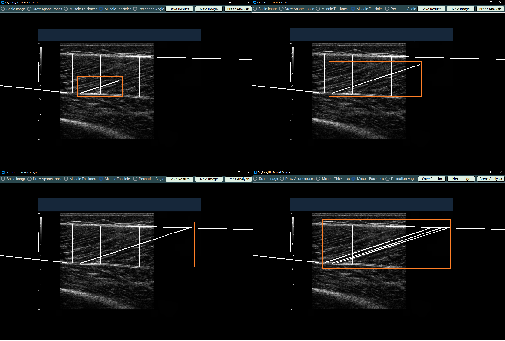

# 🖼 Manual Image Analysis

This page covers **manual image analysis** in DL_Track_US.  
In this mode, images are evaluated manually by **drawing muscle thickness, fascicle length, and pennation angles** directly onto the images.

**Important:**  
Manual analysis is applicable only for **single images** (not videos).  
All images must be contained in a single folder, e.g., `DL_Track_US_example/images_manual`.

If you have not downloaded the example folder yet, please do so:  
[DL_Track_US - Examples & Models](https://osf.io/7mjsc/?view_only=).

> 📦 Unzip the folder and save it somewhere easily accessible.

---

## 1. Creating Image Directory

- Place all images to be analyzed into a **single folder**.
- The `DL_Track_US_example/images_manual` folder contains **2 images**.

- Unlike automated analysis, you **do not** need a `flip_flag.txt` file or neural networks.
- In manual analysis, **you** are the "neural network."

---

## 2. Specifying Input Directories in the GUI

- Click the **Inputs** button in the GUI to open a selection window.
- Choose the `DL_Track_US_example/images_manual` folder.
- Click **Select folder** to confirm.

---

## 3. Specifying Analysis Parameters

- Select **image_manual** from the dropdown menu.

Then specify the **Image Type**:

- The file extension must match your images (e.g., `.tif`).
- Either select it from the dropdown or type it manually.
- For this tutorial, select **/*.tif**.

- After setting the image type, click **Run** to start the manual analysis.

---

## 4. Manual Analysis of Image

After clicking **Run**, the **Manual Analysis window** opens:

### Important rules:

- The start and end points of each line are critical — not the line itself.
- Start drawing by pressing the left mouse button; end by releasing it.
- Avoid any unwanted clicks!  
  If extra clicks happen, restart the current analysis step.

---

### 4.1 Manual Scaling

- Select **Scale Image** in the Manual Analysis window.
- Draw a **1-centimetre straight line** based on scaling bars in the image.
- A **messagebox** will guide you.

Example of the drawn line:

---

### 4.2 Drawing Aponeuroses

- Select **Draw Aponeurosis** to manually extend aponeuroses.
- A **messagebox** will instruct you.

---

### 4.3 Measuring Muscle Thickness

- Select **Muscle Thickness**.
- Draw **three straight lines** from superficial to deep aponeurosis across the muscle image.

---

### 4.4 Drawing Fascicles

- Select **Muscle Fascicles**.
- Draw at least **three fascicles** in different regions.
- Each fascicle must have **three segments**:
  - Each segment must start where the previous segment ended.
- Avoid extra mouse clicks.

---

### 4.5 Measuring Pennation Angles

- Select **Pennation Angle**.
- Draw at least **three pennation angles**:
  - Each must have **two segments**:
    1. Along the fascicle
    2. Along the deep aponeurosis

---

## 5. Saving / Breaking / Next Image

### 5.1 Saving Results

- Press the **Save Results** button after finishing each image.
- It saves:
  - An Excel file (`Manual_Results.xlsx`)
  - A screenshot of your drawing.

Saved results are stored in `DL_Track_US_example/images_manual`.

---

### 5.2 Going to Next Image

- Click the **Next Image** button to proceed.
- Always **save results first** before moving to the next image!

---

### 5.3 Breaking Analysis

- Click **Break Analysis** to terminate analysis.
- A **messagebox** will confirm your choice.
- After confirming, you return to the main GUI.

---

After saving all results, your folder should contain:

- **Input images**
- Saved **screenshots**
- The **Manual_Results.xlsx** file

---

## 6. Error Handling

If any error occurs:

- A **messagebox** will open explaining the issue.

We have tried to make all error messages as **concise** and **informative** as possible.  
Simply follow the instructions in the error box and restart the analysis after resolving the issue.

> 💬 **Note:**  
> If an unexpected error occurs that is not caught by a message box,  
> please report it in the [DL_Track_US Discussion Forum - Q&A Section](https://github.com/PaulRitsche/DLTrack/discussions/categories/q-a).

When reporting an issue:

- Please include a description of the problem,
- Steps to reproduce the issue,
- And (if possible) screenshots of the GUI and error message.

---

By following these guidelines, we can continuously improve DL_Track_US.