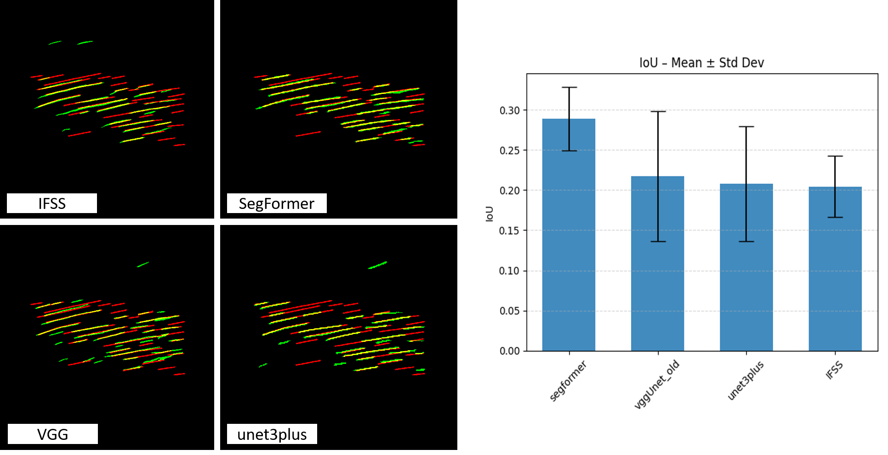
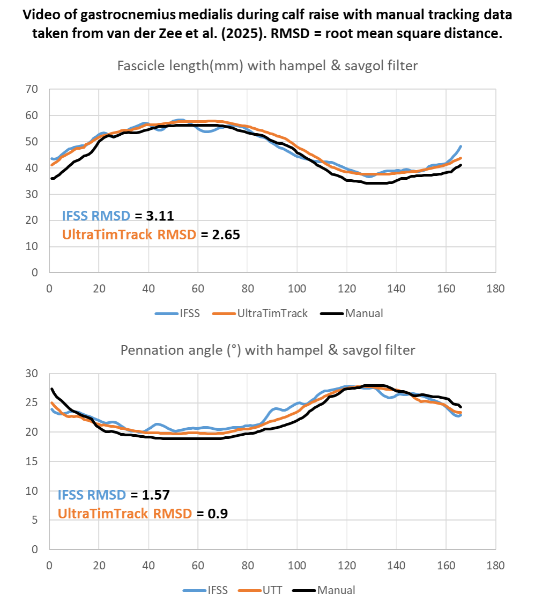

# 📰 News

---

## v0.3.0 Release Notes

- Released version 0.3.0 with major upgrades and bugfixes!
- New features: manual scaling tool, resize Video tool, crop video length tool & remove video parts tool.
- New installer for Windows.
- Faster model predictions & optional stacked (sequential) predictions.
- Improved user interface with visualization of model predictions and filtering/plotting of results.
- Automatic `settings.json` in GUI for easy switching of model parameters.
- Filtering of fascicle length and pennation angle data using hampel sand savgol filters.

👉 [See the Full Changelog on GitHub](https://github.com/PaulRitsche/DL_Track_US/blob/main/CHANGELOG.rst)

### Faster model predicitions on GPU & CPU

In version 0.3.0, we reduced processing time per frame by 40% from version 0.2.1 (RTX4080 & Intel i9), respectively.

### Improved user interface

In version 0.3.0, we improved the user interface and included real time visualization of model predictions as well as a results terminal at the end of analyis. The analysis process is now more transparent and felxibel, since we included more analysis options in the settings. 

### Video Analysis 

#### New model with bi-directional short long term memory for video analysis

We further provide a new model with a new overall aproach for fascicle anaylsis in videos. **For the first time, we provide a model with memory and awareness of surrounding frames**. The model is taken from [Chanti et al. (2021)](https://ieeexplore.ieee.org/document/9350651) and is called **IFSS-NET**. 

In our approach, we use a bi-directional short long term memory (BiLSTM) to capture the temporal context of the video. We excluded the siamese encoder from the orginal model. Furhtermore, we used a hybrid loss combination of the Dice loss and binary cross entropy loss, both weighted equally. 

To reach this decision, we compared different models and their performance compared to a manual ground thruth and a kalman-filter based tracking apporach (UltraTimTrack) proposed by [van der Zee et al. (2025)](https://peerj.com/articles/cs-2636/). 

#### Model Training results 

We compard our previous vgg16unet model ([Ritsche et al. (2024)](https://doi.org/10.1016/j.ultrasmedbio.2024.01.004)) to [SegFormer](https://arxiv.org/pdf/2105.15203), [uNet3+](https://arxiv.org/pdf/2004.08790) and [IFSS-Net](https://ieeexplore.ieee.org/document/9350651) architectures. The Results on a unseen test set of 120 images with examplary predictions can be seen below. 

Moreover, we compared the models due to similar performance to the one of the validation videos from the original paper (Ritsche et al. (2024)). This video was recently used to compare the performance of different methods for fascicle tracking ([van der Zee et al. (2025)](https://peerj.com/articles/cs-2636/)). We demonstrate improvement in the results from DL_Track_US in terms of RMSD compared to manual annotation as displayed below. Of all networks, the IFSS-Net model performed best in a trade-off between pennation angle and fascicle length RMSD. 

	

Note that, compared to v0.2.1, we introduced hampel-filtering of the fascicle values in each frame and additionally applied a savitzky-golay filter to the median fascicle data to furhter reduce root mean squared distance. The results for two different tasks are displayed below. 

##### Calf Raise

##### VL fixed end maximal knee extentsion

#### Benchmarking

Benchmark results for the IFSS-Net model will be published soon.

🚨 **More comparsions will follow in the upcoming publication.**

### Image Analysis

#### Benchmarking

We compared the results of our VGG16Unet models to the results of the benchmark dataset from [UMUD](https://universalmuscledatabase.streamlit.app/) ([Ritsche et al. (2025)](https://osf.io/preprints/osf/syr4z_v1)). We used the standard settings. The results were calcualted on a RTX4080 GPU and Intel i9 CPU. Better rsults can be achieved by adapting the analysis settings. The benchmark results can be viewed in the [OSF repository](https://osf.io/7mjsc/files/osfstorage).

|         | Muscle Thickness (mm)      | Fascicle length (mm)     | Pennation angle (°)       |
|---------|------------|------------|-------------|
| **MEAN** | 0.126911   | 3.874385   | -0.407885   |
| **STD**  | 3.339651   | 4.581032   | 1.942850    |

🚨 We are currently working on implementing tracking of fascicles accounting for their curvature.

---
