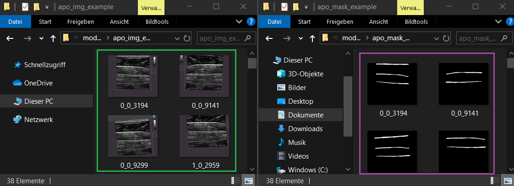
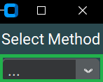
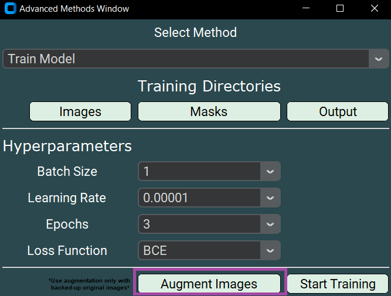
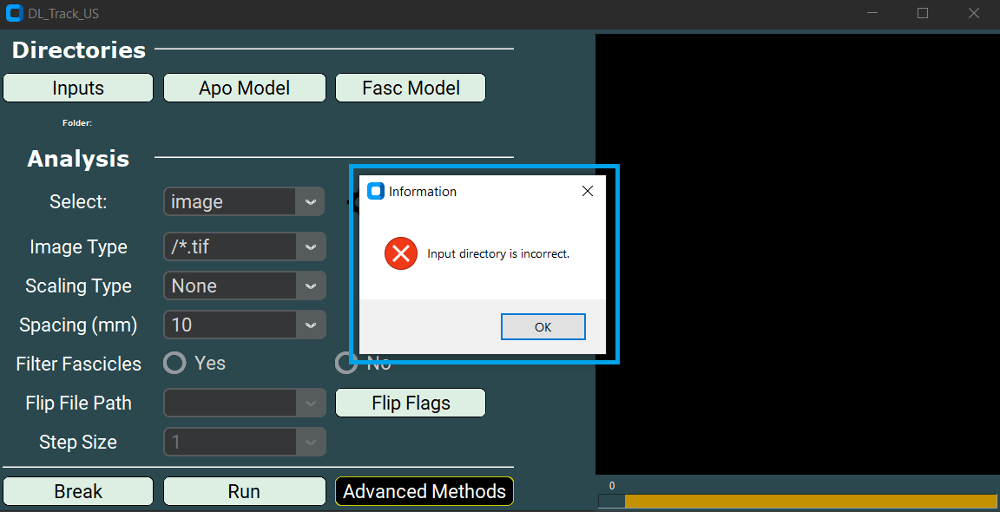
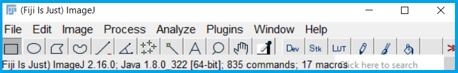
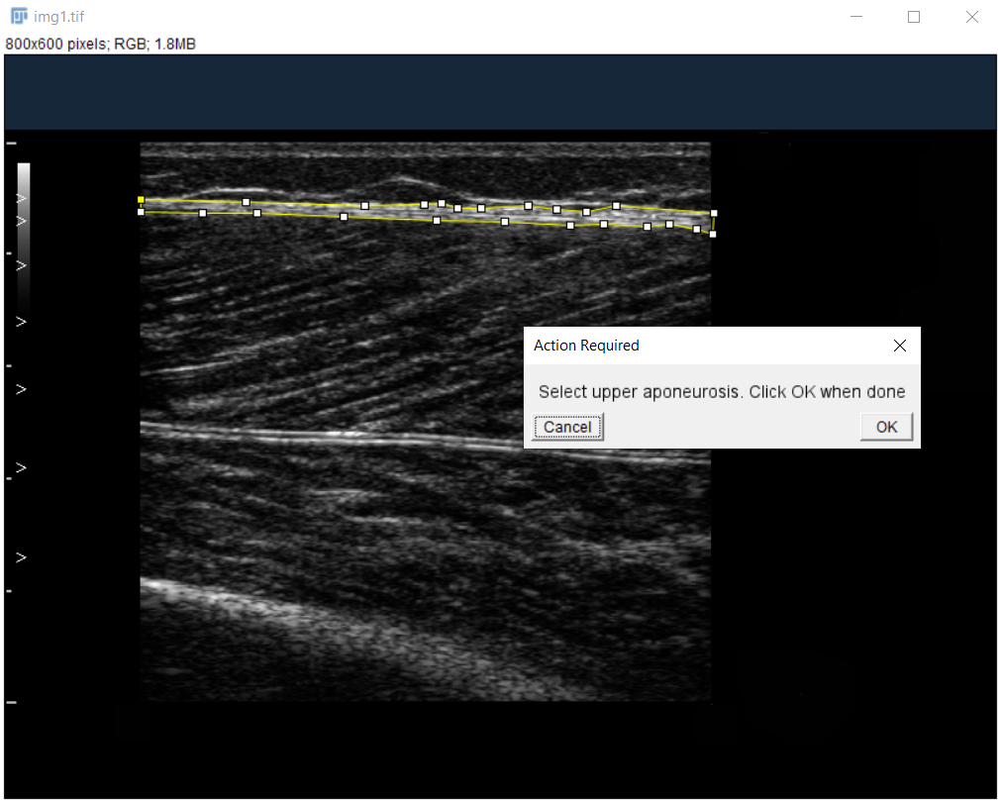
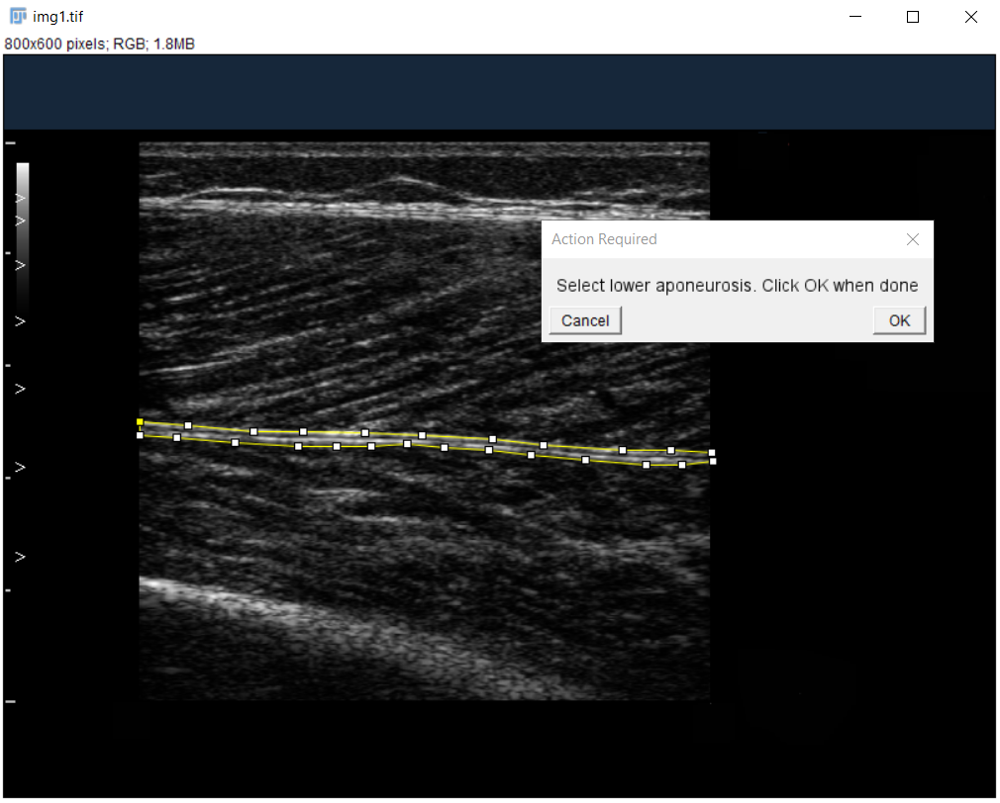

# 🧠 Training Your Own Networks

The DL_Track_US package GUI includes the possibility to **train your own neural networks**.

---

## Why train your own model?

- To create models tailored to **your own dataset**.
- To improve segmentation if the example models don't generalize well enough.
- To learn more about **deep learning** for muscle ultrasound.

> 🚨 It’s **highly recommended** to have a working **GPU setup**; otherwise training can take much longer.  
> Check out [our GitHub repository](https://github.com/PaulRitsche/DL_Track_US) for setup instructions.

If you're new to neural networks, we recommend this [introduction course](https://deeplizard.com/learn/video/gZmobeGL0Yg).

> 📝 **Note:**  
> DL_Track_US UI allows **training** but **not modifying** network architectures!

---

The paired **images** and **labeled masks** needed for training are located in:  
📁 `DL_Track_US_example/model_training`

[Download DL_Track_US Examples & Models](https://osf.io/7mjsc/?view_only=) if you haven’t already.

In this tutorial, we will train a model for **aponeurosis segmentation**.  
Training a **fascicle segmentation** model is identical — only the images and masks would differ.

---

## 1. Data Preparation and Image Labeling

Inside the `DL_Track_US_example/model_training` folder:

- 📁 **apo_img_example** → Original images  
- 📁 **apo_mask_example** → Corresponding labeled masks

> ⚡ **IMPORTANT:**  
> Image names and mask names **must match exactly**!

Example:

---

## 2. Specifying Relevant Directories

- Open the UI.
- Click the **Advanced Methods** button.
- In the dropdown, select **Train Model**.

Now specify the directories:

### Select Image Directory

- Click **Images**.
- Select `DL_Track_US_example/model_training/apo_img_example`.

---

### Select Mask Directory

- Click **Masks**.
- Select `DL_Track_US_example/model_training/apo_mask_example`.

---

### Select Output Directory

- Click **Output**.
- Choose a folder to save the trained model, loss plots, and CSV results.

---

## 3. Image Augmentation (Optional but Recommended)

Image augmentation artificially increases your dataset size by applying random transformations.

> 🚨 Especially recommended if you have fewer than 1500 images.

- Click **Augment Images**.

A messagebox will notify you once augmentation is complete.

---

## 4. Specifying Training Parameters

- Keep the default settings for this tutorial.
- **NEVER** use just 3 **epochs** for real training.  
  (3 epochs are okay only for testing.)

Now click:

- **Start Training**

Three messageboxes will guide you during the training process.

Once training is finished, you’ll find:

- Trained model (`Test_Apo.h5`)
- Training loss plot (`Training_Results.tif`)
- Loss values per epoch (`Test_apo.csv`)

---

## 5. Using Your Own Networks

You can use your trained models like this:

- Click **Apo Model** or **Fasc Model** in the GUI to load your trained model.

> ⚡ **IMPORTANT:**  
> Never use the same images for training and inference.  
> Always **validate on unseen data** to check your model's performance.

If unsure, feel free to ask in our [DL_Track_US Discussion Forum](https://github.com/PaulRitsche/DL_Track_US/discussions/categories/q-a)!

---

## 6. Error Handling

Errors during training trigger a **messagebox**:

Follow the instructions shown.  
Uncaught errors should be reported in the  
[DL_Track_US Discussion Forum](https://github.com/PaulRitsche/DL_Track_US/discussions/categories/q-a).

[See here](https://dltrack.readthedocs.io/en/latest/contribute.html) for guidance on how to best report errors.

---

## 7. Labeling Your Own Images

To train your networks, you must label images correctly.

> 🛠 We provide a semi-automated script!

You need:

- 📁 Original images folder
- 📁 `output_images` folder
- 📁 `fascicle_masks` folder
- 📁 `aponeurosis_masks` folder

You’ll use [ImageJ/Fiji](https://imagej.net/software/fiji/downloads) and our script:  
🗂 [`DL_Track_US/DL_Track_US/gui_helpers/gui_files/Image_Labeling_DL_Track_US.ijm`](https://github.com/PaulRitsche/DL_Track_US/blob/main/DL_Track_US/gui_helpers/gui_files/Image_Labeling_DL_Track_US.ijm)

Drag the `.ijm` file into a running Fiji/ImageJ window to start.

---

### Labeling Steps

1. **Set Directories**:  
   a. Input images  
   b. Aponeurosis masks  
   c. Fascicle masks  
   d. Output images

2. **Label Aponeuroses**:  
   Use polygon tool to select **superficial** and then **deep** aponeurosis.

    
    

3. **Label Fascicles**:  
   Use segmented line tool for clearly visible fascicle parts only.

    

4. **Save and Move to Next Image**.

---

> ✅ You are now ready to create your own high-quality training datasets!

---
