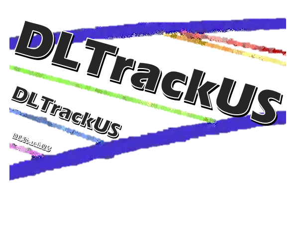

# DL_Track_US

The DL_Track_US package provides an easy to use graphical user interface (GUI) for deep learning based analysis of muscle architectural parameters from longitudinal ultrasonography images of human lower limb muscles. Please take a look at our [documentation](https://paulritsche.github.io/DL_Track_US/) for more information (note that aggressive ad-blockers might break the visualization of the repository description as well as the online documentation).
This code is based on a previously published [algorithm](https://github.com/njcronin/DL_Track) and replaces it. We have extended the functionalities of the previously proposed code. The previous code will not be updated and future updates will be included in this repository. 

## Getting started

For detailled information about installaion of the DL_Track_US python package we refer you to our [documentation](https://paulritsche.github.io/DL_Track_US/). There you will finde guidelines not only for the installation procedure of DL_Track_US, but also concerding conda and GPU setup.

## Quickstart

Once installed, DL_Track_US can be started from the command prompt with the respective environment activated:

``(DL_Track_US0.3.1) C:/User/Desktop/ python -m DL_Track_US`` 

In case you have downloaded the executable, simply double-click the DL_Track_US icon.

Regardless of the used method, the GUI should open. For detailed the desciption of our GUI as well as usage examples, please take a look at the [user instruction](https://paulritsche.github.io/DL_Track_US/). An illustration of out GUI start window is presented below. It is here where users must specify input directories, choose the preferred analysis type, specify the analysis parameters or train thrain their own neural networks based on their own training data. 

## Testing

We have not yet integrated unit testing for DL_Track_US. Nonetheless, we have provided instructions to objectively test whether DL_Track_US, once installed, is functionable. To perform the testing procedures yourself, check out the [test instructions](https://paulritsche.github.io/DL_Track_US/).

## Code documentation 

In order to see the detailled scope and description of the modules and functions included in the DL_Track_US package, you can do so either directly in the code, or in the [Documentation](https://paulritsche.github.io/DL_Track_US/) section of our online documentation.

## Community guidelines

Wheter you want to contribute, report a bug or have troubles with the DL_Track_US package, take a look at the provided [instructions](https://paulritsche.github.io/DL_Track_US/) how to best do so.

## Research

### v0.3.1 

- Released version 0.3.1 with minor upgrades and bugfixes. 
- New feature: Weighted aponeurosis calculation and queing of loaded video frames to increase processing speed for videos.

### v0.3.0

- Major upgrades and bugfixes!
- New features: manual scaling tool, resize Video tool, crop video length tool & remove video parts tool.
- Faster model predictions & optional stacked (sequential) predictions.
- Improved user interface with visualization of model predictions and filtering/plotting of results.
- Automatic `settings.json` in GUI for easy switching of model parameters.
- Filtering of fascicle length and pennation angle data using hampel sand savgol filters.

#### Faster model predicitions on GPU & CPU

In the new version, we reduced processing time per frame by 40% from version 0.2.1 on GPU and CPU to 0.6s and ... , respectively.

#### Improved user interface

In version 0.3.0 we improved the user interface and included real time visualization of model predictions as well as a results terminal at the end of analyis. The analysis process is now more transparent and felxibel, since we included more analysis options in the settings. 

#### New model with bi-directional short long term memory for video analysis

We further provide a new model with a new overall aproach for fascicle anylsis in videos. **For the first time, we provide a model with memory and awareness of surrounding frames**. The model is taken from [Chanti et al. (2021)](https://ieeexplore.ieee.org/document/9350651) and is called **IFSS_NET**. 

In our approach, we use a bi-directional short long term memory (BiLSTM) to capture the temporal context of the video. We excluded the siamese encoder from the orginal model. Furhtermore, we used a hybrid loss combination of the Dice loss and binary cross entropy loss, both weighted equally. 

To reach this decision, we compared different models and their performance compared to a manual ground thruth and a kalman-filter based tracking apporach (UltraTimTrack) proposed by [van der Zee et al. (2025)](https://peerj.com/articles/cs-2636/). 

#### Model Training results 

We compard our previous vgg16unet model ([Ritsche et al. (2024)](https://doi.org/10.1016/j.ultrasmedbio.2024.01.004)) to [SegFormer](https://arxiv.org/pdf/2105.15203), [uNet3+](https://arxiv.org/pdf/2004.08790) and [IFSS-Net](https://ieeexplore.ieee.org/document/9350651) architectures. The Results on a unseen test set of 120 images with examplary predictions can be seen below. 

Moreover, we compared the models due to similar performance to the one of the validation videos from the original paper (Ritsche et al. (2024)). This video was recently used to compare the performance of different methods for fascicle tracking ([van der Zee et al. (2025)](https://peerj.com/articles/cs-2636/)). We demonstrate improvement in the results from DL_Track_US in terms of RMSD compared to manual annotation as displayed below. Of all networks, the IFSS-Net model performed best in a trade-off between pennation angle and fascicle length RMSD. 

	

Note that, compared to v0.2.1, we introduced hampel-filtering of the fascicle values in each frame and additionally applied a savitzky-golay filter to the median fascicle data to furhter reduce root mean squared distance. The results for three different tasks are displayed below. 

##### Calf Raise

##### VL fixed end maximal knee extentsion

🚨 **More comparsions will follow in the upcoming publication.**

🚨 We are currently working on implementing tracking of fascicles accounting for their curvature.

### v0.2.1 and prior

The previously published [algorithm](https://github.com/njcronin/DL_Track_US) was developed with the aim to compare the performance of the trained deep learning models with manual analysis of muscle fascicle length, muscle fascicle pennation angle and muscle thickness. The results were presented in a published [preprint](https://arxiv.org/pdf/2009.04790.pdf). The results demonstrated in the article described the DL_Track_US algorithm to be comparable with manual analysis of muscle fascicle length, muscle fascicle pennation angle and muscle thickness in ultrasonography images as well as videos. The results are briefly illustrated in the figures below.

Analysis process from original input image to output result for images of two muscles, gastrocnemius medialis (GM) and vastus lateralis (VL). Subsequent to inputting the original images into the models, predictions are generated by the models for the aponeuroses (apo) and fascicles as displayed in the binary images. Based on the binary image, the output result is calculated by post-processing operations, fascicles and aponeuroses are drawn and the values for fascicle length, pennation angle and muscle thickness are displayed.

Bland-Altman plots of the results obtained with our approach versus the results of manual analyses by the authors (mean of all 3). Results are shown for muscle fascicle length (A), pennation angle (B), and muscle thickness (C). For these plots, only the median fascicle values from the deep learning approach were used, and thickness was computed from the centre of the image. Solid and dotted lines depict bias and 95% limits of agreement, respectively.

A comparison of fascicle lengths computed using DL_Track_US with those from [UltraTrack](https://sites.google.com/site/ultratracksoftware/home)(Farris & Lichtwark, 2016, DOI:10.1016/j.cmpb.2016.02.016), a semi-automated method of identifying muscle fascicles. Each row shows trials from a particular task (3 examples per task from different individuals, shown in separate columns). For DL_Track_US, the length of each individual fascicle detected in every frame is denoted by a gray dot. Solid black lines denote the mean length of all detected fascicles by DL_Track_US. Red dashed lines show the results of tracking a single fascicle with Ultratrack.

## Related Work

The DL_Track_US package can only be used for the automatic analysis of longitudinal muscle ultrasonography images containing muscle architectural parameters. However, in order to assess muscle anatomical cross-sectional area (ACSA), panoramic ultrasonography images in the transversal plane are required. We recently published [DeepACSA](https://journals.lww.com/acsm-msse/Abstract/2022/12000/DeepACSA__Automatic_Segmentation_of.21.aspx), an open source algorithm for automatic analysis of muscle ACSA in panoramic ultrasonography images of the human vastus lateralis, rectus femoris and gastrocnemius medialis. The repository containing the code and installation as well as usage instructions is locate [here](https://github.com/PaulRitsche/DeepACSA).

